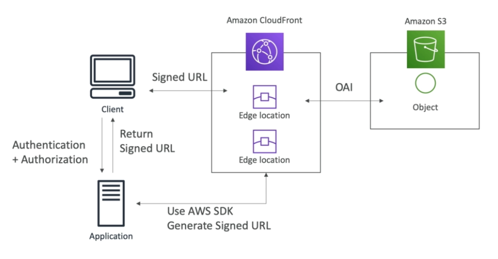

## AWS CloudFront

Content Delivery Network (CDN).

- A CDN is a mechanism to deliver content quickly and efficiently based on geographic location.
- Improves read performance, content is cached at the edge
- There are 216 Point of Presence globally (edge locations)
- DDos protection, integration with Shield, AWS Web Application Firewall
- Can expose external HTTPS and can talk to internal HTTPS backends

### CloudFront at a high level

CloudFront is often used with S3 to deploy content globally.
Client request to an Edge Location and the Edge Location would then forward request to your origin. And Edge Location would cache the return.

### CloudFront - Origins

- **S3 bucket**
  - For distributing files and caching them at the edge
  - Enhanced security with CloudFront Origin Access Identity (OAI) - Limit the S3 bucket to be accessed only using this identity
  - CloudFront can be used as an ingress (to upload files to S3)
- **Custom Origin** (must be HTTP)
  - EC2 instance (must be public)
  - Application Load Balancer (must be public, resources behind it can be private)
  - S3 website (must first enable the bucket as a static S3 website)
  - Any HTTP backend you want

### CloudFront - Restriction

#### Geo Restriction

You can restrict who can access your distribution

- Whitelist: Allow your users to access your content only if they're in one of the countries on a list of approved countries.
- Blacklist

Note: The "country" is determined using a 3rd party Geo-IP database

Use case: Copyright laws to control access to content

### CloudFront vs S3 Cross Region Replication

**CloudFront:**

Great for static content that must be available everywhere

- Global Edge network
- Files are cached for a TTL (maybe a day)

**S3 Cross Region Replication:**

Great for dynamic content that needs to be available at low-latency in few regions

- Must be setup for each region you want replication to happen
- Files are updated in near real-time
- Read only

### CloudFront Caching

The cache lives at each CloudFront Edge Location. 

Cache based on:

- Headers
- Session Cookies
- Query String Parameters

You want to maximise the cache hit rate to minimise requests on the origin.

- Control the TTL (0 second to 1 year), by setting the origin using the Cache-Control header, Expires header
- You can invalidate part of the cache using the `CreateInvalidation` API

#### CloudFront - Maximise cache hits by separating static and dynamic distributions

### CloudFront Security

Using Geo Restriction.

#### CloudFront and HTTPS

- Viewer Protocol Policy (between client and Edge Location)
  - Redirect HTTP to HTTPS
  - Or use HTTPS only
- Origin (HTTP or S3) Protocol Policy (between Edge Location and Origin):
  - HTTPS only
  - Or Match Viewer (client using HTTP=> HTTP & client using HTTPS=> HTTPS )

Note: S3 bucket "websites" don't support HTTPS.

### CloudFront Signed URL/ Signed Cookies

**Signed URL** = access to individual files (one signed URL per file).

**Signed Coolies** = access to multiple files (one signed cookie for many files).

To distribute paid shared content to premium users over the world, we can use CloudFront Signed URL/ Cookie. We attach a policy with:

- Includes URL expiration
- Include IP ranges to access the data from
- Trusted signers (which AWS accounts can create signed URLs)

How long should the URL be valid for?

- Shared content (movie, music): make it short (a few minutes)
- Private content (private to the user): you can make it last for years

##### CloudFront Signed URL Diagram

#### CloudFront Signed URL vs S3 Pre-Signed URL

CloudFront Signed URL:

- Allow access to  a path, **no matter the origin** (S3 or HTTP)
- Account wide key-pair, only the root can manage it
- Can filter by IP, path, date, expiration
- Can leverage caching features

S3 Pre-Signed URL:

- Issue a request as the person who pre-signed the URL
- Uses the IAM key of the signing IAM principal
- Limited lifetime

## Other Content Delivery Services
### Global Accelerator
Sends your users through the AWS global network when accessing your content, speeding up delivery.
- Improves latency and availability of single-region apps.
- 60% performance boost.
- Automatically re-routes traffic to healthy available regional endpoints.

### S3 Transfer Accelerator
Improves content uploads and downloads to and from S3 buckets. 
- Fast transfer of files over long distances.
- Uses CloudFront's globally distributed edge locations.
- Customers around the world can upload to a central bucket.
