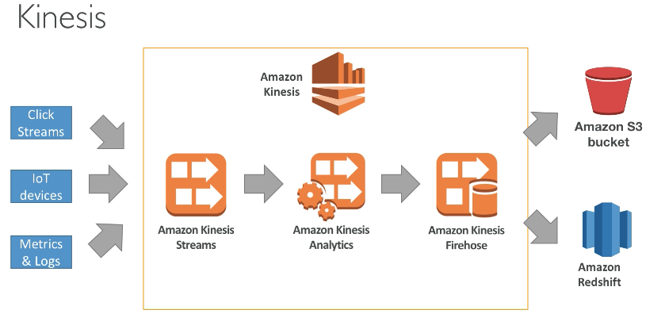
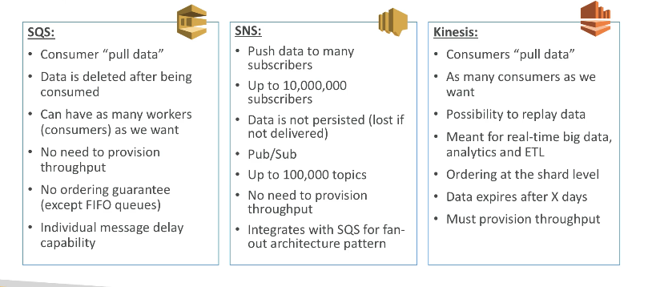

## Integration And Messaging

When we start deploying multiple applications, they will inevitably need to communicate with one another. There are two patterns of application communication:

- Synchronous communications (application to application) 
- Asynchronous / Event based (application to queue to application)

Synchronous between application can be problematic if there are sudden spikes of traffic. In that case, it's better to decouple your applications:

- using SQS: queue model
- using SNS: pub/sub model
- using Kinesis: real-time streaming model

These services can scale independently from your application.

### Amazon SQS

One or more producer will send messages to SQS Queue and one or more consumers will poll messages from the queue.

Attributes:

- Unlimited throughput, unlimited number of messages in queue
- Default retention of messages: 4 days, maximum of 14 days
- Low latency (< 10 ms on publish and receive)
- Limitation of 256KB per message sent

Can have duplicate messages (at least once delivery, occasionally)

Can have out of order messages (best effort ordering)

#### SQS - Producing Messages

Produced to SQS using the SDK (`SendMessage` API). The message is persisted in SQS until a consumer deletes it. 

#### SQS - Consuming Messages

Consumers (running on EC2 instances, servers, or AWS Lambda)

- poll SQS for messages (receive up to 10 messages at a time)
- process the messages (e.g. insert the messages into an RDS database)
- Delete the messages using the `DeleteMessage` API

##### Multiple EC2 Instances Consumers

Consumers receive and process messages in parallel.

- At least once delivery
- Best-effort message ordering
- Consumers delete messages after processing them

We can scale consumers horizontally to improve throughput of processing.

##### SQS with Auto Scaling Group (ASG)

Using CloudWatch Metric to monitor Queue Length and trigger Alarm to scale.

#### SQS - Security

**Encryption:**

- In-flight encryption using HTTPS API
- At-rest encryption using KMS keys
- Client-side encryption if the client wants to perform encryption/ decryption itself.

**Access Controls:** IAM policies to regulate access to the SQS API

**SQS Access Policies** (similar to S3 bucket policies):

- Useful for crossing-account access to SQS queue
- Useful for allowing other services (SNS, S3...) to write to an SQS queue

#### SQS - Message Visibility Timeout

After a message is polled by a consumer, it becomes invisible to other consumers. By default, the message visibility timeout is 30 seconds. That means the message has 30 seconds to be processed. After the message visibility timeout is over, the message is "visible" in SQS if haven't been deleted.

If a message is not processed within the visibility timeout, it will be processed twice. A consumer could call the `ChangeMessageVisibility` API to get more time (appropriate for your app).

- If visibility timeout is high (hours), and consumer crashes, re-processing will take time.
- If visibility timeout is too low (seconds), we may get duplicates.

#### SQS - Deal Letter Queue

If a consumer fails to process a message within the Visibility Timeout the message goes back to the queue. We can set a threshold of how many times a message can go back to the queue. After the MaximumReceives threshold is exceeded, the message goes into a dead letter queue (DLQ).

This is useful for debugging. But make sure to process the messages in the DLQ before they expire. It's good to set a retention of 14 days in the DLQ. 

#### SQS - Delay Queue

Delay a message (consumers don't see it immediately) up to 15 minutes (default is 0 seconds). Can set a default at queue level. Can override the default on send using the `DelaySeconds` parameter.

#### SQS - Long Polling

When a consumer requests messages from the queue, it can optionally "wait" for messages to arrive if there are none in the queue. This is called Long Polling. LongPolling decreases the number of API calls made to SQS while increasing the efficiency and latency of your application. The wait time can be between 1 sec to 20 sec (20 preferable).

Long Polling is preferable to Short Polling. Long polling can be enabled at the queue level or at the API level using `WaitTimeSeconds`.

#### SQS Extended Client

Message size limit is 256KB. To send large messages, use the SQS Extended Client. So it only send a small metadata message to the SQS Queue but store the large message to S3. When the consumer receives small metadata message, it will retrieve large message from S3.

#### SQS - Must know API

CreateQueue (MessageRetentionPeriod), DeleteQueue

PurgeQueue: delete all the messages in queue

SendMessage (DelaySeconds), ReceiveMessage, DeleteMessage

ReceiveMessageWaitTimeSeconds: Long Polling

ChangeMessageVisibility: change the message timeout

Batch APIs for SendMessage, DeleteMessage, ChangeMessageVisibility helps decrease your costs

#### SQS - FIFO Queues

Ordering of messages in the queue. Limited throughput: 300 msg/s without batching, 3000 msg/s with.

Exactly-once send capability (by removing duplicates).

Messages are processed in order by the consumer.

The name of the queue has to be `*.fifo`.

##### SQS FIFO - Deduplication

De-duplication interval is 5 minutes. Two de-duplication methods:

- Content-based deduplication: will do a SHA-256 hash of the message body
- Explicitly provide a Message Deduplication ID

##### SQS FIFO - Message Grouping

If you specify the same value of `MessageGroupID` in an SQS FIFO queues, you can only have one consumer, and all the messages are in order.

To get ordering at the level of a subset of messages, specify different values for `MessageGroupID`. 

- Message that share a common Message Group ID will be in order within the group.
- Each Group ID can have a different consumer (parallel processing)
- Ordering across groups is not guaranteed

### Amazon SNS

Send a message to many receivers. 

- The "event producer" only sends message to one SNS topic.
- Each SNS topic could have up to 10,000,000 "event receivers" (subscriptions).
- All subscriber to the topic will get all the messages. (New feature to filter messages)
- 100,000 topics limit
- Subscribers can be:
  - SQS
  - HTTP/ HTTPS (with delivery retries - how many times)
  - Lambda
  - Emails
  - SMS messages
  - Mobile Notifications

#### SNS integrates with a lot of AWS services

Many AWS services can send data directly to SNS for notifications.

- CloudWatch (for alarms)
- Auto Scaling Groups notifications
- Amazon S3 (on bucket events)
- CloudFormation (upon state changes => failed to build, etc)

#### AWS SNS - How to publish

Topic Publish (using the SDK)

- Create a topic
- Create a subscription (or many)
- Publish to the topic

Direct Publish (for mobile apps SDK)

- Create a platform application
- Create a platform endpoint
- Publish to the platform endpoint
- Works with Google GCM, Apple APNS, Amazon ADM

#### Amazon SNS - Security

- Encryption:
  - In-flight encryption using HTTPS API
  - At-rest encryption using KMS keys
  - Client-side encryption if the client wants to perform encryption/decryption itself

- Access Controls: IAM policies to regulate access to the SNS API
- SNS Access Policies (similar to S3 bucket policies)
  - Useful for cross-account access to SNS topics
  - Useful for allowing other services (S3...) to write to an SNS topic n 

### SNS + SQS: Fan Out

Send a message to many SQSs. Make sure your SQS queue access policy allows for SNS to write.

- Fully decoupled, no data loss.
- SQS allow for: data persistence, delayed processing and retries of work
- Ability to add more SQS subscribers over time

**AWS limitation:** SNS cannot send messages to SQS FIFO queues

### AWS Kinesis

A managed alternative to Apache Kafka.

- Great for application logs, metrics, IoT, clickstreams.
- Great for "real-time" big data
- Great for streaming processing framework (Spark, NiFi, etc...)
- Data is automatically replicated to 3 AZ

**Kinesis Streams:** low latency streaming ingest at scale

**Kinesis Analytics:** perform real-time analytics on streams using SQL

**Kinesis Firehose:** load streams into S3, Redshift, ElasticSearch...

#### Kinesis Streams

Streams are divided in ordered Shards/ Partitions. Data retention is 1 day by default, can go up to 7 days.

producers => Shard1/ Shard2/ ... => consumers

- Ability to reprocess/ replay data
- Multiple applications can consume the same stream
- Real-time processing with scale of throughput
- Once data is inserted in Kinesis, it can't be deleted (immutability)

##### Kinesis Streams Shards

One stream is made of many different shards. The number of shards can evolve over time (reshard/ merge)

- 1 MB/s or 1000 messages/s at write PER SHARD.
- 2 MB/s at read PER SHARD
- Billing is per shard provisioned, can have as many shards as you want
- Batching available or per message calls
- Records are ordered per shard

##### AWS Kinesis API - Put records

`PutRecord` API. Partition key that gets hashed determines shard id to go to. The same key goes to the same partition (helps with ordering for a specific key)

- Messages sent get a "sequence number"

- Choose a partition key taht is highly distributed (helps prevent "hot partition")
  - user_id if many users
  - Not country_id if 90% of the users are in one country
- Use Batching with PutRecords to reduce costs and increase throughput.
- Can use CLI, AWS SDK, or producer libraries from various frameworks

##### AWS Kinesis API - Exceptions

`ProvisionedThroughputExceeded` Exceptions if we go over the limits.

- Happens when sending more data (exceeding MB/s or TPS for any shard)

**Solution:**

- Retries with backoff
- Increase shards (scaling)
- Ensure your partition key is a good one

##### AWS Kinesis API - Consumers

Can use a normal consumer (CLI, SDK, etc...). Can use Kinesis Client Library:

- KCL uses DynamoDB to checkpoint offsets
- KCL uses DynamoDB to track other workers and share the work amongst shards

##### Kinesis KCL

Kinesis Client Library (KCL) is Java library that helps read record from a Kinesis Streams with distributed applications sharing the read workload.

**Rule:** A KCL instance can read from multiple shards. But each shard is be read by only one KCL instance.

Records are read in order at the shard level. Progress is checkpointed into DynamoDB (need IAM access)

KCL can run on EC2, Elastic Beanstalk, or Premise Application.

##### AWS Kinesis API - Get records

Call `GetShardIterator` first by providing stream name and shard id. Then call `GetRecords` by providing shard iterator.

#### Kinesis Security

- Control access/ authorisation using IAM policies.
- Encryption in flight using HTTPS endpoints
- Encryption at rest using KMS
- Possibility to encrypt/ decrypt data client side (harder)
- VPC Endpoints available for Kinesis to access within VPC

#### AWS Kinesis Data Analytics

Perform real-time analytics on Kinesis Streams using SQL. You pay for actual consumption rate. Can create streams out of the real-time queries.

- Auto scaling
- Managed: no servers to provision
- Continuous: real time

#### AWS Kinesis Firehose

- Fully Managed Service, no administration.

- Near Real Time (60s latency).
- Load data into Redshift/ Amazon S3/ ElasticSearch/ Splunk
- Automatic scaling
- Support many data format (pay for conversion)
- Pay for the amount of data going though Firehose

### SQS vs SNS vs Kinesis

