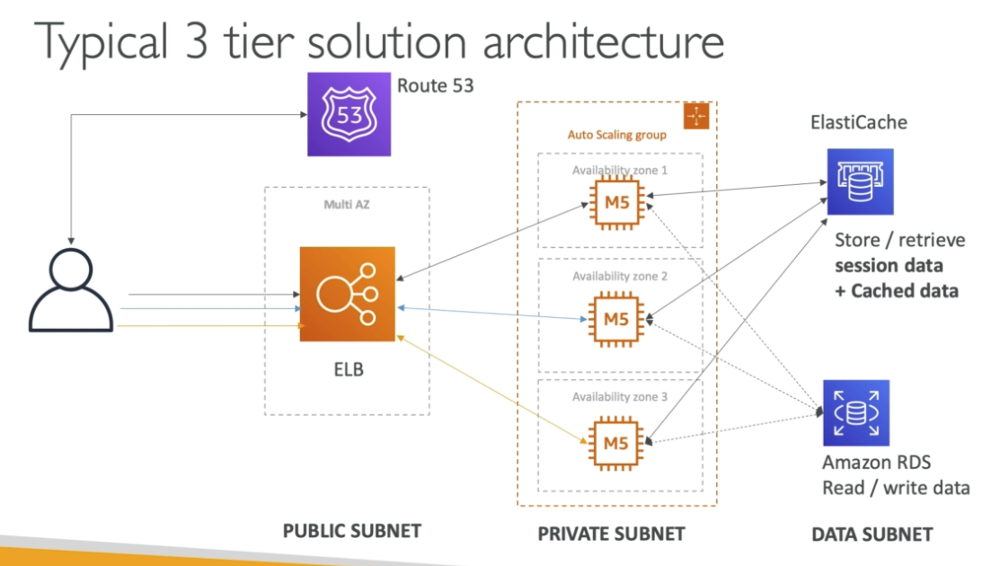

## VPC

VPC: Virtual private cloud (regional resource)

Subnets: Tied to an AZ (can't across AZs), network partition of the VPC (AZ resource)

- Public subnet: a subnet that is accessible from the internet (has 1 by default) 

Route Tables: define access to the internet and between subnets 

### Internet Gateway & NAT Gateways

Internet Gateway: at the VPC level, provide to private subnets. Helps our VPC instances connect with the internet.

Public Subnets have a route to the internet gateway.

**NAT Gateway** (AWS-managed) & NAT Instances (self-managed): give internet access to private subnets

Private subnet has a route to NAT and NAT has a route to Internet Gateway.

### Network ACL & Security Groups

Network ACL: A firewall which controls traffic from and to subnet. (1st mechanism of defense)

- Subnet rules for inbound and outbound.
- Rules only include IP addresses
- A default NACL allows everything in and out

Security Groups: A firewall that controls traffic to and from an ENI/ an EC2 instance. (2nd mechanism of defense)

- Rules include IP addresses and other security groups

| Network ACL                                                  | Security Group                                               |
| ------------------------------------------------------------ | ------------------------------------------------------------ |
| Operates at the subnet level                                 | Operates at the instances level or ENI                       |
| Supports ALLOW and DENY rules.                               | Can have only ALLOW rules (Everything is blocked by default) |
| Stateless: Return traffic must be explicitly allowed by rules | Stateful: Return traffic is automatically allowed, regardless of any rules |
| Process rules in number order when deciding whether to allow traffic | Evaluate all rules before deciding whether to allow traffic  |
| Automatically applies to all instances in the subnets it's associated with. | Applies to an instance only if someone specifies the security group to it. |

### VPC Peering

Connect two VPC, privately using ASW's network. Make them behave as if they were in the same network. To achieve that, there must not have overlapping [CIDR](https://cidr.xyz) (IP ranges) 

VPC Peering connection is not transitive (A connected with B & A connected with C. B can't talk to C naturally)

### VPC Endpoints

Allows you to connect to AWS Services within VPC using a private network instead of the public www network. This gives you enhanced security and lower latency to access AWS services.

Access to resources outside VPC:

- S3 or DynamoDB: **VPC Endpoint Gateway**
- The rest: **VPC Endpoint Interface**

### VPC Flow Logs

Network traffic logs. Capture info about IP traffic going into your interfaces:

- VPC Flow Logs
- Subnet Flow Logs
- Elastic Network Interface Flow Logs

Helps to monitor & troubleshoot connectivity issues. (Subnets to internet, subnets to subnets & internet to subnets)

Also capture network info from AWS managed interfaces: Elastic Load Balancers, ElastiCache, RDS, Aurora, etc...

Log data can go to S3/ CloudWatch Logs.

### Site to Site VPN & Direct Connect

**Note:** Site-to-site VPN and Direct Connect cannot access VPC endpoints.

#### Direct Connect

Direct private physical connections between on-premises and AWS. The connection is private, secure and fast.

- Goes over a private network
- Takes at least a month to establish

#### Site to Site VPN

VPN over public internet between on-premises DC/internal networks and AWS VPCs.

- Similar to Direct Connect but data travels over the public internet.
- The connection is automatically encrypted.
- Supports a hybrid environment.

Virtual Private Gateway: The VPN connector on the AWS side.  
Customer Gateway: The VPN connector on the customer side.

### Three Tier Architecture

